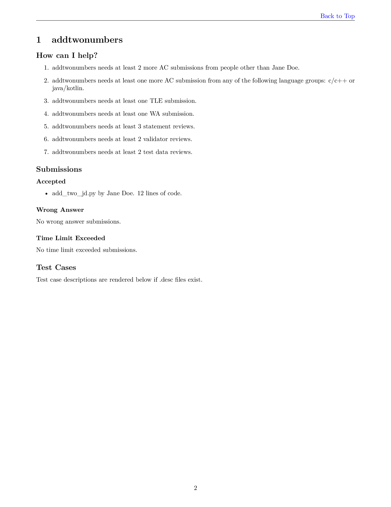

# CRIFX

CRIFX is the Contest pReparation Insights tool For anyone (X).

Its purpose is to automatically produce pdf reports that give insights into
tasks that are completed and tasks that are still outstanding in preparing
an icpc-style competitive programming contest.

## Installation
Install crifx with `pip install crifx`. Building the report will require some
TeX packages. For example, on Ubuntu 22.04 installing the `texlive-latex-extra` 
apt package with `apt-get install texlive-latex-extra` should be sufficient.

If you are using a different operating system, and you are able to run crifx, then 
please share your experience by opening an Issue and I would be pleased to update
installation instructions accordingly.

## Using crifx
In the root directory for a problemset, run `crifx` from within a problemset nested
directory, or run `crifx /path/to/problemset/root` from anywhere to generate a report
for the problemset at the specified path. 
If there is no `crifx.toml` configuration file in the problemset root directory, 
then a report will be created using default configuration values.

Crifx can be configured by adding a `crifx.toml` file to the root of the problemset 
directory. The configuration can be used to define requirements on things like
the number of indepenedent AC submissions for each problem, groups of programming
languages and the number of submissions needed from each group or the number of 
distinct groups required. The configuration file can also be used to specify the
names of people involved in contest preparation such that filenames and special
strings in judge submissions can be used to associate submissions with those 
people.

## Counting independent submissions

### How crifx decides the author of a submission
In order of precedence, crifx determines the author of a file by:
1. The presence of a crifx!(author="name") string in the text of a submission file.
2. The presence of an underscore separated name string that matches an alias in the
   `crifx.toml` configuration file.
3. The git user associated with the largest number of lines in the git blame. Roughly speaking this will be
   the git user that created/changed the largest number of lines in the current revision.

The `crifx.toml` file is used to define the aliases of a submission author and associate them with
a git username. More details to come, including an example.

If you encounter a scenario where crifx is incorrectly attributing a submission to the wrong person
and it cannot easily be fixed by adding a user and alias to the `crifx.toml` file.
Crifx does not yet support disambiguating git users with the same git name.

## Configuration

### Top-level
The top-level configuration of `crifx` is defined in a TOML text file named 
`crifx.toml` placed in the directory containing the directories for each problem.


- `github_repo_url`. Optional. String. Default: `null`. The GitHub repository url for 
the problem set. This should be the root url for the repository and not the url to 
some directory in the repository tree.

#### `[review_requirements]`

- `independent_ac`. Optional. Integer. Default: `3`.
- `language_groups`. Optional. Integer. Default: `2`.
- `submissions_wa`. Optional. Integer. Default: `1`.
- `submissions_tle`. Optional. Integer. Default: `1`.
- `statement_reviewers`. Optional. Integer. Default: `3`.
- `validator_reviewers`. Optional. Integer. Default: `2`.
- `data_reviewers`. Optional. Integer. Default: `2`.

#### `[[judge]]`
The `judge` array of tables is used to associate judge names and aliases. The
judge name can also optionally be associated with a git name.
- `primary_name`. Required. String. A name to identify the judge with. This name
will be used in the `crifx` report when listing who wrote each submission and who 
is ineligible to provide further contributions for a problem. 
- `git_name`. Optional. String. This is the git name for the judge if they 
have one. Note that this is _not_ the GitHub username. From the command line, you 
can see your git name with the command `git config user.name`. By 
specifying a `git_name`, submissions from a judge that are uploaded or edited by 
someone else can be associated with submissions that the judge themself uploads. 
For the submission uploaded by someone else, the submission will need to be 
identified by file name or a `crifx!(author=name)` string in the submission file.
- `aliases`. Optional. Array of Strings. List of aliases that can be used to identify 
the judge. Submission file names are split into parts by underscores. If any part 
matches an alias of a judge, then the submission is assumed to belong to the judge 
with the alias and associated primary name/git name. Aliases can also be used in
`crifx!(author=name)` strings inside submission files to identify a judge.

#### `[[language_group]]`
- `name`. Required. String. A name to use for the language group. E.g., `"C/C++"`
- `languages`. Required. Array of Strings. A list of languages to include in the
group. The languages must be known to `crifx`.
- `required_ac_count`. Optional. Integer. Default: `0`. The number of Accepted 
submissions that are required for this language group. E.g., a value of `2` means 
that each problem must have at least `2` accepted submissions from languages in 
this language group.

### Per problem configuration
For each problem, a TOML text file placed in the root directory for the problem
(i.e., at the same level as the `problem.yaml` file and the `submissions` directory), 
called `crifx-problem-status.toml`. This file can be used to track who has reviewed
different parts of a problem. It can also be used to define some per-problem configuration.

- `github_issue_id`. Optional. Integer. Default: `null`. The GitHub Issue id number 
for a GitHub Issue that may have been created to discuss the problem. This is used 
to generate links to the GitHub Issue url from within the `crifx` report.

#### `[review_status]`
- `statement_reviewed_by`. Optional. Array of Strings. A list of judge aliases for 
judges that have reviewed the problem statement and are happy with the state of the
problem statement for use in a contest. The judge's name should only be added to this 
list if they think that the statement is clear and unambiguous.
- `validators_reviewed_by`. Optional. Array of Strings. A list of judge aliases for
judges that have reviewed the input (and output) validators. The judge's name should 
only be added to this list if they have verified that the input validator checks all 
guarantees made in the problem statement about the input data.
- `data_reviewed_by`. Optional. Array of Strings. A list of judge aliases for judges 
that have reviewed the test data (secret and sample). The judge's name should only 
be added to this list if they have inspected the generated test data and after doing 
so they cannot think of another test case that should be added to ensure that correct 
submissions will be judged as correct and incorrect submissions will be judged as 
incorrect.

## Example
Below is an example `crifx.toml` file.
```toml
# Crifx configuration file example.

# The github repository url for this problemset. This can be used to include
# hyperlinks to GitHub Issues for each problem in the report.
github_repo_url = "https://github.com/FinnLidbetter/crifx"

# Section for defining minimum numbers of submissions and manual reviews.
[review_requirements]
# There must be AC submissions from at least 3 distinct judges.
independent_ac = 3
# There must be at least 2 distinct language groups with at least one AC
# submission written in a language in the group.
language_groups = 2
# There must be at least one wrong_answer submission.
submissions_wa = 1
# There must be at least one time_limit_exceeded submission.
submissions_tle = 1
# There must be at least 3 judges who have reviewed the problem statement.
statement_reviewers = 3
# There must be at least 2 judges who have reviewed the input validators.
validator_reviewers = 2
# There must be at least 2 judges who have reviewed the test data.
data_reviewers = 2

# Define judge names in `[[judge]]` tables.
[[judge]]
# Primary name is required.
primary_name = "Jane Doe"
# git_name is not required.
# git_name = "janedoe"
# Aliases is a list of zero or more alternative names.
aliases = ["jd", "jane"]

[[judge]]
primary_name = "Homer Simpson"
git_name = "homers123"
aliases = []

# Tables for defining language groups.
[[language_group]]
# Non alphanumeric characters can be used in the language group name.
name = "c/c++"
# The names of the languages in the group. Language names are cast to
# lowercase before comparison to language names known to crifx.
languages = ["C", "C++"]
# The number of AC submissions required for this group.
required_ac_count = 0

[[language_group]]
name = "java/kotlin"
languages = ["Java", "Kotlin"]
required_ac_count = 0

[[language_group]]
name = "python"
languages = ["Python"]
required_ac_count = 0
```
Here is an example `crifx-problem-status.toml` file inside the 
`examples/example_problemset/helloworld/` directory.
```toml
# GitHub Issue id number associated with this problem.
github_issue_id = 1

[review_status]
# List of names of judges who have reviewed the problem statement.
statement_reviewed_by = [
    "Alice",
    "Bob",
    "Jane Doe",
]
# List of names of judges who have reviewed the input validator(s).
validators_reviewed_by = [
    "Homer Simpson",
]
# List of names of judges who have reviewed the test data.
data_reviewed_by = [
    "Homer Simpson",
    "Bob",
]
```

This example report screenshot is produced from the example in `examples/example_problemset`



